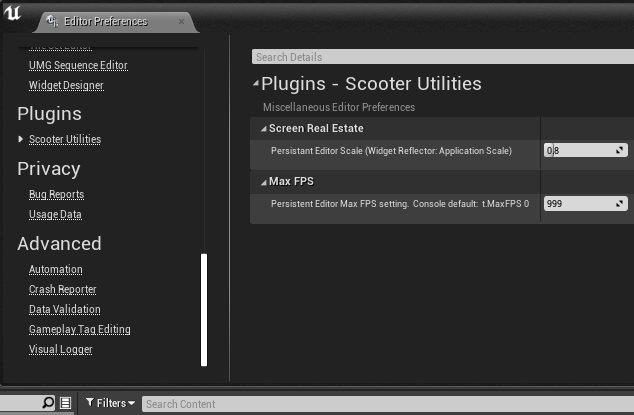
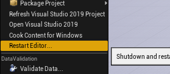

[ScooterUtils](https://github.com/ScottKirvan/ScooterUtils)
==================

 A Unreal Engine editor plugin which contains miscellaneous
 artist/developer utilities.

If common tasks can be automated or streamlined, they may end up in ScooterUtils.





Plugin currently contains:
- *Screen Real Estate* - found in the
**Editor Preferences** under **Plugins/Scooter Utilities**
- *Maximum FPS* - found in **Editor Preferences**
under **Plugins/Scooter Utilities**
- Restart Editor - From the Main Menu bar, choose **File > Restart Editor...**
- Show Project in Explorer - From the Main Menu bar, choose **File > Show Project in Explorer**
  
The persistent editor Settings, in Windows, are stored in this file:  
```C:\Users\<username>\AppData\Local\UnrealEngine\<EngineVersion>\Saved\Config\Windows\EditorSettings.ini```

## Getting up and running

### Screen Real Estate 
Once the plugin is built and loaded, you can find the **Screen Real Estate**
setting by choosing **Edit > Editor Preferences** from the Main Menu bar, and
then selecting **Plugins/Scooter Utilities**.

The *Persistant Editor Scale* value is a percentage relative to the default 
screen size of elements like fonts, buttons, and other widgets in the Unreal 
Engine UI.  I like to work with all the fluff scaled down to about 80% of 
what's considered "normal," so I set the Persistant Editor Scale to *0.8*.

This same setting is available in the Unreal Editor by going to
the Main Menu bar, selecting **Window > Developer Tools > Widget Reflector**,
and changing the **Application Scale** setting.  However, the **Widget Reflector**
method doesn't stick -- you have to set it everytime you restart **Unreal
Engine**.  The Scooter Utility writes this value to your Config
file, so you don't have to constantly re-set it.

### Max FPS
The **Max FPS** (Maximum Frames Per Second)
setting is found in the Main Menu bar; **Edit > Editor Preferences**, 
then selecting **Plugins/Scooter Utilities**.

**Max FPS** overrides the console variable setting (```t.MaxFPS```) and sets
the engine's maximum editor frame rate.  Like the Screen Real Estate setting
above, if you use ```t.MaxFPS```, it will reset any time you shutdown or restart 
the editor.  Using the **ScooterUtils Max FPS** setting will be persistent and 
stay set until you reset it.  Set it to ```0``` to let the system take over the 
default.

Turn off **Smooth Frame Rate** and **Used Fixed Frame Rate** under
**Edit > Project Preferences**, **General Settings/Framerate** if you need to 
unclamp the system and run it as freewheeling as possible (These
are off by default).

### Restart Editor...
**Restart Editor** is found in the Main Menu bar, under
  **File > Restart Editor...**.

This will shutdown and restart unreal engine, prompting you to save any unsaved changes, and reload 
your project on restart.  This is the same behavior you see when you enable or disable a plugin.

This is for developers that need to frequently restart the engine to test code changes.  It's also 
nice for those times you've been working in the editor for a while and things just start to feel... um...
off.  Just hit **Restart Editor...** and you're project will shutdown and restart -- no launcher popping up and prompting 
for what to load, and no searching in file explorer to find the uproject file to open.

### Show Project in Explorer
**Show Project in Explorer** is found in the Main Menu bar, under
  **File > Show Project in Explorer**.

This will open file explorer in your main project folder -- i.e. the same folder as your project's `.uproject` file.

Being able to open the project in Explorer is nice for when you've opened a project from the Launcher and you need to know where it's actually stored on disk.  You can also do this by right clicking on assets in the content browser, which will take you do your project's content folder, but this menu makes it a bit quicker to get to.

### Installation

This is kind of standard practice for GitHub Unreal plugins; it goes
like this:

1. Create a new Unreal project.
1. Create a ```Plugins``` folder in your project directory.
1. Clone the GitHub repository (or grab and unzip the project) into your
```Plugins``` folder.
1. Launch Unreal; You should be prompted to build the plugin.
2. Optional:  Use or convert your unreal project to a C++ project so
that you can edit and build the code outside of Unreal.


## About - for Developers

This was my first plugin in Unreal Engine.
It was inspired by a [declined Epic Games Github Pull
Request](https://github.com/EpicGames/UnrealEngine/pull/7436).  It's very
simple and direct -- I wanted to understand the bare bones of the system,
so there's not a lot of bells-and-whistles in this code.

The plugin has two components, an ``IModuleInterface`` derived
``FScooterUtilsModule``, which bootstraps and provides basic life-support
to the plugin, and an ``IObject`` derived ``IScooterUtilsSettings``
object which is the system-aware component that works directly
with Unreal's ``ISettingsModule`` and ``FSlateApplication``'s
``ApplicationScale``.  The *Module* registers the callbacks and the
*IObject* manages the data and processes the callbacks.

First impressions, being new to the system:  The system itself -- the
thin veil between the editor and the code, between the *UnrealBuildTool*
and the Artist -- brilliant.  Conceptually, there is a hurdle --
*there is no plugin api.*  You write your code to the entire surface
of the application and all it's various plugins.  -- and getting build
dependencies figured is a very high bar, but those details should be in
the background, and once they are, it takes very little hard coding to
pull together the pieces you need to accomplish what you're after.

## Supported Platforms

This plug-in was developed and built against **Unreal Engine 4.25, 4.26, 4.27, 5.0, 5.1, 5.2, & 5.3**. It
should work on other
platforms.

## Dependencies

This plugin is source code only - I'm not currently providing binaries.
If you're looking for binaries for the Windows version, contact me
and I'll try get you a build.  If you need an older build or another
platform, I won't be able to build it for you, so you're going to have to get in touch with someone that can
help you (See the Support/Contacts section below).

The source requires Visual Studio (I;ve used the free 2019 & 2022 community versionc)
and either an Unreal C++ code (rather than blueprint) project or the full
Unreal Engine 4 source code from GitHub (just use the project-based
approach, it's so easy). 

Building it inside a project is dead simple.  Clone the repository
into the *Plugins* directory of your Unreal C++ based project. Go to
**File**, and select **Update Visual Studio Project**.  From there,
the plugin should be buildable, and once compiled, can be left in your
project directory for the project you're working on, or copied into
your Engine's main *Plugins* folder so it's available to all your future
editing sessions.  

If you are new to programming in UE,
please see the official [Programming
Guide](https://docs.unrealengine.com/en-US/Programming/Plugins/index.html)!
The plugin development workflow is really very impressive, and if you've
ever developed plugins for other applications, you should check it out.  

## Contributions

- Please [file an
issue](https://github.com/ScottKirvan/UE4-ScooterUtils/issues),
or grab a fork, hack away, and submit [pull
requests](https://github.com/ScottKirvan/UE4-ScooterUtils/pulls?q=is%3Aopen+is%3Apr).
- Contact me at
[linkedin.com/in/scottkirvan/](https://www.linkedin.com/in/scottkirvan/)
- You can also contact me at my [discord](https://discord.gg/TSKHvVFYxB)
server, I'm cptvideo.

To locate other developers, I recommend the **# cpp** and **#
engine-source** channels on the **Unreal Slackers** Discord server.

## References / Inspirations / Credits

- sign into the Unreal Engine [Learning &
Support](https://www.unrealengine.com/en-US/learn) area and take the
*Best Practices for Creating and Using Plugins* course - it's great!
- This blog post on [custom project
settings](http://www.mov-eax-rgb.net/blog/custom-settings-object/)
is short, but it saved me when I got stuck
- The Unreal Team!  I had only been learning Unreal for a little
over a month when I first wrote this.  I am so totally blown away.
Epic's training material is outstanding - The sheer amount of material
available, directly from Unreal, and being produced by end users, artists,
and programmers is unlike anything I've ever experienced in the industry.
- Again, thanks to [Caio Liberali](https://github.com/caioliberali) for
the original [Pull Request](https://github.com/EpicGames/UnrealEngine/p)
on Github.  I had been hacking around in the engine source trying to
accomplish the same thing when the Pull Request came in.  Had it not
been declined, I probably never would have said, "hey, why not make it
a plugin?"

## Credits

**Copyright (c) (2020):** [Scott Kirvan](https://github.com/ScottKirvan)  - All rights reserved   
*ScooterUtils is licensed under the [BSD 3-Clause License](LICENSE.md).*  

Project Link:  [ScottKirvan/ScooterUtils](https://github.com/ScottKirvan/ScooterUtils)  
[CHANGELOG](notes/CHANGELOG.md)  
[TODO](notes/TODO.md)


