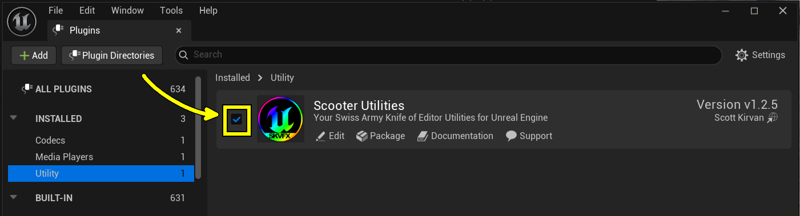

<table border=0><tr><td valign=center>  </td><td valign=top> <a style="color:#ffffff" href="http://skvfx.com">skvfx.com</a> / <a style="color:#ffffff" href="http://skvfx.com/ScooterUtils">ScooterUtils</a> </td></tr></table> 
 <h1><a style="color:#ffffff" href="https://www.fab.com/sellers/SKVFX">Scooter Utilities</a></h1>Your Swiss Army Knife of editor tools for Unreal Engine    <h4> <!-- <a href="https://tinyurl.com/3vf7whyd">View Demo</a>  ·  --> <a href="https://scottkirvan.com/ScooterUtils/notes/USER_README.html">User Documentation</a>  ·  <a href="https://github.com/ScottKirvan/ScooterUtils/issues/new?labels=bug&title=%5BBUG%5D">Report Bug</a>  ·  <a href="https://github.com/ScottKirvan/ScooterUtils/issues/new?labels=enhancement&title=%5BFEATURE+REQUEST%5D">Request Feature</a> </h4> 

**Scooter Utilities** is an Unreal Engine editor plugin that bundles essential quality-of-life tools for artists and developers. Quickly navigate to disk files, restart/reload your projects with a single click, and keep important settings persistent between editor sessions.

## Table of Contents

- [Features](#features)
- [Download and Install from FAB](#download-and-install-from-fab)
- [Enable Scooter Utilities](#enable-scooter-utilities)
- [Menus](#menus)
    - [File > Restart Editor...](#file--restart-editor)
    - [File > Show Project in Explorer](#file--show-project-in-explorer)
- [Editor Preferences > Persistent Editor Properties](#editor-preferences--persistent-editor-properties)
    - [Screen Real Estate: Persistent Editor Scale](#prefs-screen-real-estate-persistent-editor-scale)
    - [Max FPS](#prefs-max-fps)
    - [Show FPS](#prefs-show-fps)
- [Blueprint Nodes](#blueprint-nodes)
- [Contributing](#contributing)
- [Support/Contact](#supportcontact)
- [Credits](#credits)

## Features

- **Toolbar dropdown button** in the Level Editor for quick access to plugin tools and settings
- **Restart the editor** from the File menu or toolbar—no more hunting for your .uproject file
- **Customizable hotkey** for restarting the editor (default: Ctrl+Shift+Alt+R)
- **Open your project folder** in File Explorer with one click
- **Adjust the editor interface scale** for comfortable viewing or presentations
- **Set a persistent Maximum FPS** that survives editor restarts
- **Keep the viewport FPS display enabled** across sessions
- **Blueprint nodes** for file I/O, config access, debug logging, and more

## Download and Install from FAB

> [!WARNING]  
> This plugin isn't yet available on fab.com as of this writing, but it's anticipated to be available soon. The documentation here assumes you've downloaded and installed the plugin from Fab.

If you've gotten **Scooter Utilities** through Fab Marketplace, downloading and installing is handled through fab.com and the Unreal Marketplace:

1. From fab.com, after purchase, click the `Download` link on the [**Scooter Utilities**]() product listing
2. A web pop-up will appear with a link to the `Epic Games Launcher`—click that link to open the launcher
3. In the Launcher, scroll down to your **Fab Library**, find "**Scooter Utilities**," and click `Install to Engine`
4. If prompted, select the engine version you want the plugin installed to

For source-code installation or manual setup, please follow the Installation Instructions in the [Developer Documentation](https://www.scottkirvan.com/ScooterUtils/).

## Enable Scooter Utilities

To enable ScooterUtils in your project, navigate to **Edit > Plugins**, then search for and check the box next to "Scooter Utilities" to enable it for your project.

## Menus

> [!NOTE]
> Make sure you've enabled the Scooter Utilities plugin via **Edit > Plugins** before looking for these menu items.

Scooter Utilities adds a toolbar dropdown button to the Play toolbar and two new menu items to the **File Menu**.

### Toolbar Dropdown

A dropdown button appears in the Level Editor's Play toolbar (enabled by default, can be toggled in settings). The dropdown provides quick access to:

- **Restart Editor...** - Restart the editor with the current project
- **Show Project in Explorer** - Open the project folder on disk
- **Plugin Settings...** - Jump directly to the Scooter Utilities settings page

The toolbar button can be shown or hidden via **Edit > Editor Preferences > Plugins > Scooter Utilities > UI > Show Toolbar Button**. Changes require an editor restart.

### File > Restart Editor...

Shuts down and restarts Unreal Engine, prompting you to save any unsaved changes before reloading your project. This is the same behavior you see when enabling or disabling a plugin.

**Hotkey:** Ctrl+Shift+Alt+R (customizable in Editor Preferences)

**Why use this?** Perfect for developers who frequently restart the engine to test code changes, clear undo stacks, or refresh the system. It's also great when the editor starts feeling sluggish—just hit **Restart Editor...** and you're back in action without navigating through the launcher or hunting for your .uproject file.

### File > Show Project in Explorer

Opens File Explorer focused on your main project folder (where your `.uproject` file lives).

**Why use this?** Handy when you've opened a project from the Launcher and need to know where it actually lives on disk. While you can right-click assets in the Content Browser to open the content folder, this menu item takes you directly to the project root.

## Editor Preferences > Persistent Editor Properties

Scooter Utilities' Editor Preferences let you configure settings that persist across editor restarts and projects.

To access these settings: **Edit > Editor Preferences...** → **Plugins** section → **Scooter Utilities**.

| Section            | Name                              | Description                                                                               |
| ------------------ | --------------------------------- | ----------------------------------------------------------------------------------------- |
| Screen Real Estate |                                   |                                                                                           |
|                    | **Application Scale**             | Adjust the size of editor interface fonts and widgets for comfort or presentations        |
| FPS                |                                   |                                                                                           |
|                    | **Show Viewport FPS**             | Shows current FPS in the editor viewport (like `stat fps`), but persists between restarts |
|                    | **Max FPS**                       | Same as `t.MaxFPS`, but persistent across sessions                                        |
| Hotkeys            |                                   |                                                                                           |
|                    | **Enable Restart Editor Hotkey**  | Enable/disable the restart editor hotkey (requires editor restart)                        |
|                    | **Restart Editor Hotkey**         | Customize the hotkey (default: Ctrl+Shift+Alt+R, requires editor restart)                |
| UI                 |                                   |                                                                                           |
|                    | **Show Toolbar Button**           | Show/hide the Scooter Utils toolbar dropdown button (requires editor restart)             |
| Plugin Settings    |                                   |                                                                                           |
|                    | **Enable Plugin By Default**      | Control whether this plugin is enabled by default for new projects                        |
| About              |                                   |                                                                                           |
|                    | **Version**                       | Scooter Utilities Version (read-only)                                                     |

### Prefs: Screen Real Estate: Persistent Editor Scale

> [!NOTE]  
> This setting overrides **Editor Preferences > Appearance > Application Scale**. When you disable this setting, the editor defaults back to 1.0. If your Appearance setting is not 1.0, you may need to restart the editor to apply the correct scale.

**Location:** **Edit > Editor Preferences** → **Plugins/Scooter Utilities** → **Screen Real Estate** section

The _Persistent Editor Scale_ value is a percentage relative to the default screen size of UI elements like fonts, buttons, and widgets. For example, setting it to _0.8_ scales everything down to 80% of normal size.

**Background:** As of Unreal Engine 5.4, there's an Application Scale setting under **Editor Preferences/Appearance** that works great but resets between projects. The Scooter Utilities setting is persistent and works globally across all projects.

### Prefs: Max FPS

**Location:** **Edit > Editor Preferences** → **Plugins/Scooter Utilities** → **Max FPS** section

_Persistent Editor Max FPS Setting_ overrides the console variable `t.MaxFPS`, which sets the engine's maximum editor frame rate. This setting persists across all projects and restarts. Set it to `0` to let the system's console settings take over.

**For best performance:** Turn off **Smooth Frame Rate** and **Use Fixed Frame Rate** under **Edit > Project Settings** → **General Settings/Framerate** (these are typically off by default).

### Prefs: Show FPS

**Location:** **Edit > Editor Preferences** → **Plugins/Scooter Utilities** → **Show FPS Onscreen** section

_Viewport Toggle: Show FPS_ turns on the FPS display in the editor viewport and keeps it enabled between restarts.

This provides the same functionality as the viewport's hamburger menu **Show FPS** setting, but persists across editor sessions.

## Blueprint Nodes

Blueprint nodes are found under the **Scooter Utilities** category in the Blueprint node browser. The plugin exposes several practical helpers grouped by purpose. Each node includes helpful tooltips and search keywords.

### Global Config (DefaultEngine.ini)

**Category:** "Scooter Utilities|Global Config"

**Nodes:**

- Get Global Config File String (Section, Key) → String
- Get Global Config File Float (Section, Key) → Float
- Get Global Config File Int (Section, Key) → Int
- Get Global Config File Bool (Section, Key) → Bool
- Set Global Config File String (Section, Key, Value)
- Set Global Config File Float (Section, Key, Value)
- Set Global Config File Int (Section, Key, Value)
- Set Global Config File Bool (Section, Key, Value)

**Description:**  
Read and write values from your engine's global configuration files (for example, `DefaultEngine.ini`). Pass the INI section (e.g., `/Script/Engine.GameEngine`) and the key name to read or write. Set nodes flush changes to disk immediately.

**Quick Example:**

1. Call `Get Global Config File String` with Section `/Script/Engine.Engine` and Key `GameViewportClientClassName`
2. Inspect the returned string or call `Set Global Config File String` to update it

**Notes:**

- Section strings must match exactly as they appear in the INI file (e.g., `/Script/AndroidRuntimeSettings.AndroidRuntimeSettings`)
- Use carefully—changing engine config values can affect editor behavior. Prefer project-specific config files when possible

### File IO (Saved / Content / Documents)

**Category:** "Scooter Utilities|File IO"

**Nodes:**

- Load File To String (LoadLocation, FileName) → OutString, OutFilePath, Bool
- Save Text To File (SaveLocation, FileName, Content) → OutFullPath, Bool
- Append Text To File (SaveLocation, FileName, Content, bAddLineBreak) → OutFullPath, Bool

**Description:**
Simple file read/write helpers with support for multiple directory locations. All nodes accept a `Location` parameter to specify where files should be loaded from or saved to:

- **Project Saved Directory** - Your project's `Saved` folder
- **User Documents Folder** - The user's Documents directory (cross-platform)
- **Project Content Directory** - Your project's `Content` folder

`Load File To String` reads a text file from the specified location and returns both the file contents and the full path. `Save Text To File` and `Append Text To File` create parent directories as needed and will overwrite (or append to) files at the chosen location.

**Example Usage:**
- Load a file: Call `Load File To String` with `LoadLocation = ProjectSaved` and `FileName = "Config/Settings.txt"` to read from your project's Saved folder
- Save a debug dump: Call `Save Text To File` with `SaveLocation = ProjectSaved`, `FileName = "Logs/DebugDump.txt"`, and your text content. The node returns the full path it wrote to
- Save to user documents: Use `SaveLocation = UserDocuments` to write files to the user's Documents folder, which persists outside your project

**Warning:**
Save operations overwrite files without confirmation. Use `Append Text To File` to preserve existing content.

### Debug Print / Logging

**Category:** "Scooter Utilities|Debug Print"

**Node:**

- Log Message (LogFile, Level, Content, Context) → Bool

**Description:**  
Writes a message to the editor Output Log and optionally to a file under your project's `Saved/Logs` folder. Supports severity levels (Info, Warning, Error, Critical) and an optional Context string. Timestamps and file/line information (when called from C++ helpers) are included.

**Example:**

1. Call `Log Message` with `LogFile = "MyGame.log"`, `Level = Info`, `Content = "Player joined: " + PlayerName`, `Context = "Multiplayer"`
2. The message appears in the Output Log and writes to `Saved/Logs/MyGame.log`

**Notes:**

- Leave `LogFile` empty to only write to the Output Log
- Check the in-editor tooltip for additional options

### Blueprint Reflection

**Category:** "Scooter Utilities|Blueprint Reflection"

**Nodes:**

- Get Calling Blueprint Name (WorldContextObject) → String
- Get Calling Blueprint Path (WorldContextObject) → String (Editor-only)
- Get Calling Blueprint Info (WorldContextObject) → OutBlueprintName, OutContentPath, OutFullPath, OutFullReferencePath (Editor-only)

**Description:**  
Utility nodes that identify which Blueprint called a function. `Get Calling Blueprint Name` is useful for runtime logging, while `Get Calling Blueprint Path` and `Get Calling Blueprint Info` provide editor-only package and content paths for debugging and tooling.

**Example:**  
From any Blueprint, pass `self` into `Get Calling Blueprint Name` to retrieve the Blueprint class name (e.g., `BP_PlayerCharacter`).

**Notes:**  
Editor-only nodes return the most useful results in editor builds and may return empty strings or limited information in packaged/shipping builds.

### Lorem Ipsum / Placeholder Text

**Category:** "Scooter Utilities|Lorem Ipsum"

**Nodes:**

- Generate Lorem Ipsum (NumParagraphs, MinSentences, MaxSentences) → String
- Generate Sentences (NumSentences) → String
- Generate Words (NumWords) → String

**Description:**  
Quickly generate dummy placeholder text for UI mockups, art passes, or layout testing. Perfect for designers and UI artists who need realistic-looking text blocks without copying real content.

**Example:**  
Call `Generate Lorem Ipsum` with 2 paragraphs to populate a UI text block for layout testing.

### Finding Nodes and Tooltips

Open the Blueprint editor and right-click on the canvas to open the node browser. Search for "Scooter Utilities" or use keywords like "config," "log," "file," or "lorem" to find nodes quickly. Each node contains a tooltip describing parameters and behavior.

### Editor-Only Behavior and Packaging

Some functions expose editor-only information (paths and Blueprint internals). These work best in editor builds and may return reduced data or empty strings in packaged/shipping builds.

_Need examples?_ If you'd like code snippets or visual Blueprint graphs for any of these nodes, open an issue or request an example in the repo.

## Contributing

Got a cool tool or feature idea? Found a bug? Want to help with documentation? We'd love your contributions!

**For technical contributors:**  
Check the [issues](https://github.com/ScottKirvan/ScooterUtils/issues) page to find something to tackle. The best way to contribute is directly to the code or documentation: [grab a fork](https://github.com/ScottKirvan/ScooterUtils/fork) and submit a [pull request](https://github.com/ScottKirvan/ScooterUtils/pulls). See our [Developer Documentation](https://www.scottkirvan.com/ScooterUtils/)  for technical details.

**For everyone else:**  
You don't need to know GitHub to help! Just follow these links:

- [Report a bug](https://github.com/ScottKirvan/ScooterUtils/issues/new?labels=bug&title=%5BBUG%5D)
- [Request a feature](https://github.com/ScottKirvan/ScooterUtils/issues/new?labels=enhancement&title=%5BFEATURE+REQUEST%5D)

**Show your support:**  
Rate/review the plugin on [fab.com](http://fab.com/) or donate to support development (links coming soon).

## Support/Contact

- Find me on the [Unreal Slackers](https://discord.gg/unreal-slackers) Discord as @Fragmanget_. Tons of other Unreal programmers hang out there too
- You can also reach me on my personal [Discord Server](https://discord.gg/TSKHvVFYxB) (@cptvideo), via [LinkedIn](https://www.linkedin.com/in/scottkirvan/), or [email](mailto:ScooterUtils@skvfx.com)

## Credits

**Copyright © 2020-2025:** [Scott Kirvan](https://github.com/ScottKirvan) - All rights reserved  
_ScooterUtils is licensed under the [BSD 3-Clause License](../LICENSE.md)._

**Project Link:** [ScottKirvan/ScooterUtils](https://github.com/ScottKirvan/ScooterUtils)  
[CHANGELOG](CHANGELOG.md) | [TODO](TODO.md)
